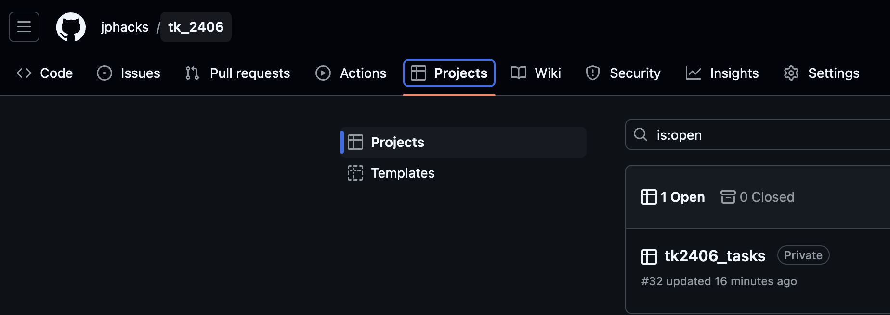
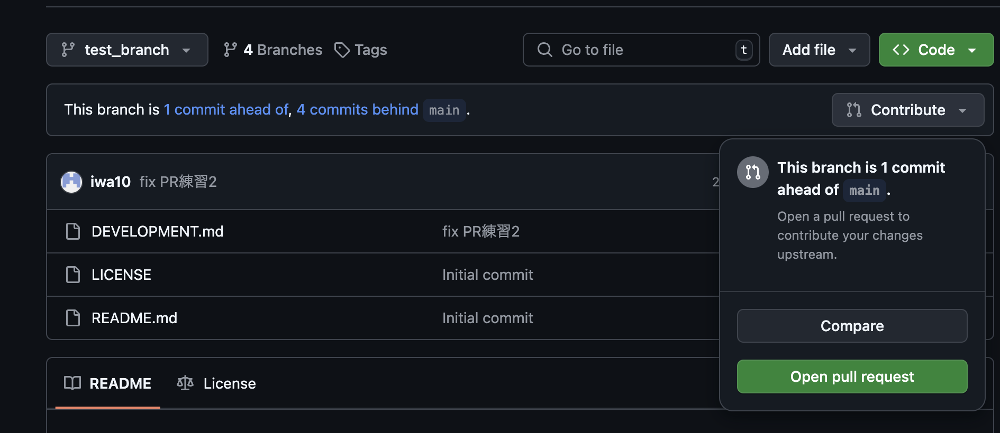

## GitHub Projectを使ったタスク管理

GithubにあるProjectでTask管理をしている。すで(10/25 Fri)にタスクは書いてある。

## ブランチのルールとか
main への直push禁止。必ず別のブランチを切ったうえでpull requestを出すこと。

## Pull Requestの使い方
- `git switch -c xxxx` // ブランチxxxxという名前で新規ブランチを作成
- 編集する
- `git add {編集したファイル}`
- `git commit {コミットメッセージ}`
- `git push` // このpushはうまくいくはず、
    -  `git push --set-upstream origin xxxx` (初めてならこっち)
- ブラウザでgithub を見に行って PRを出す。branchを変更するとでてくる
